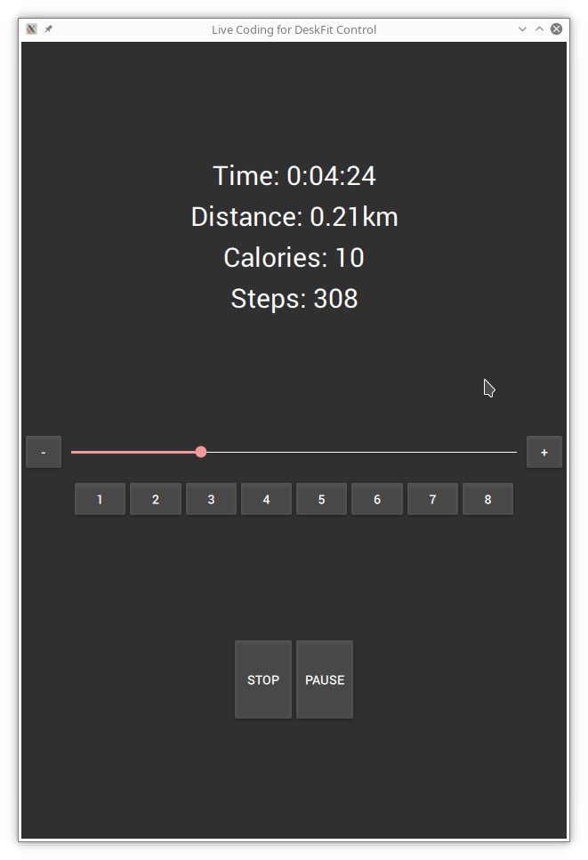

# SportsTech Deskfit DFT200 Control App
[](https://webkit.org/code-style-guidelines/)

This is an alternative control application for the [SportsTech Deskfit DFT200](https://www.sportstech.de/deskfit-dft200) desk treadmill.

I created this application because I was unsatisfied with the original one and most importantly I needed a client for my desktop computer.



## Installation on Debian Buster (here: Raspberry Pi)

1. Install the following required packages:

```
sudo apt install \
	qml-module-qtquick-controls \
	qml-module-qtquick-controls2 \
	qt5-default \
	qt5-default \
	qt-base \
	qtconnectivity5-dev \
	qtcreator \
	qtdeclarative5-dev \
	qtdeclarative5-dev \
	qtquickcontrols2 \
	qtquickcontrols2-5-dev \
	qtquickcontrols2-5-examples \
	qtquickcontrols5-examples
```

2. Generate Makefile using qmake:

```
qmake .
```

3. Edit `MainPanel.qml` and enter the Uuid of your threadmill

4. Build

```
make -j6
```

5. Give it access to bluetooth scanning:

```
sudo setcap cap_net_raw,cap_net_admin+eip deskfit
```
